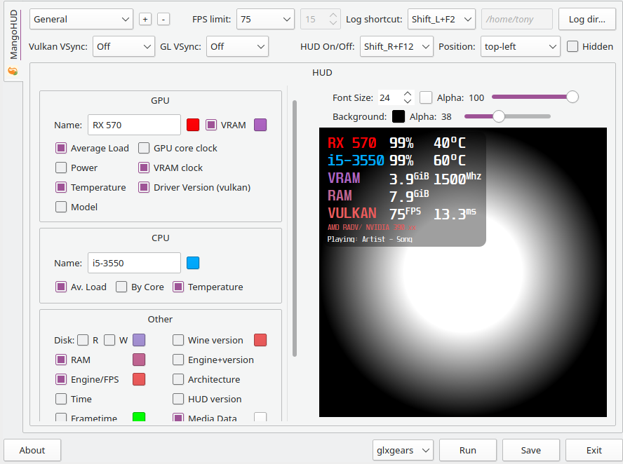

# Linux Game-Tweaks

 Linux Overlay configurations (OpenGL and Vulkan).



For: MangoHUD

## Dependences 

- Qt5
- python-setproctitle

#### Optional

- [mangohud](https://github.com/flightlessmango/MangoHud)
- mesa-demos
- vulkan-tools


## Install/Uninstall

```
git clone https://github.com/tonehrk/Linux-Game-Tweaks.git
cd Linux-Game-Tweaks
```

Give execute permissions
```
chmod +x install.sh
```

& run install.sh via terminal with "--install" or "--uninstall" option as sudo

Install:
```
sudo sh install.sh --install
```
Uninstall:
```
sudo sh install.sh --uninstall
```

## Run without installing
After git clone, run via terminal: 
```
cd src
python linux-game-tweaks.py
```
